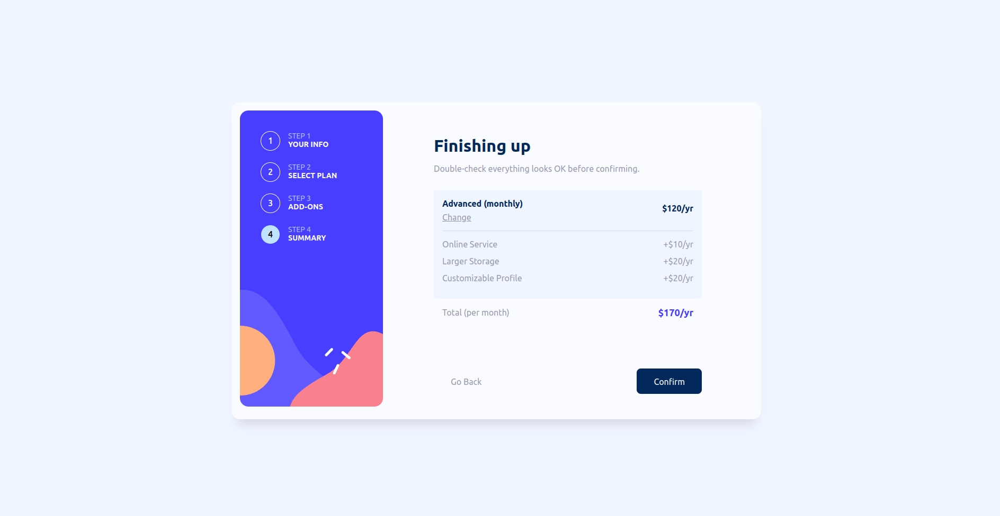
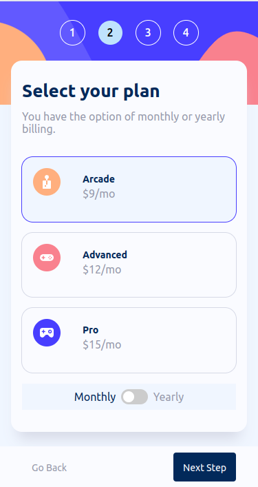

# Frontend Mentor - Multi-step form solution

This is a solution to the [Multi-step form challenge on Frontend Mentor](https://www.frontendmentor.io/challenges/multistep-form-YVAnSdqQBJ). Frontend Mentor challenges help you improve your coding skills by building realistic projects. 

## Table of contents

- [Overview](#overview)
  - [The challenge](#the-challenge)
  - [Screenshot](#screenshot)
  - [Links](#links)
- [My process](#my-process)
  - [Built with](#built-with)
  - [What I learned](#what-i-learned)
  - [Continued development](#continued-development)
- [Author](#author)


## Overview

### The challenge

Users should be able to:

- Complete each step of the sequence
- Go back to a previous step to update their selections
- See a summary of their selections on the final step and confirm their order
- View the optimal layout for the interface depending on their device's screen size
- See hover and focus states for all interactive elements on the page
- Receive form validation messages if:
  - A field has been missed
  - The email address is not formatted correctly
  - A step is submitted, but no selection has been made

### Screenshot




Add a screenshot of your solution. The easiest way to do this is to use Firefox to view your project, right-click the page and select "Take a Screenshot". You can choose either a full-height screenshot or a cropped one based on how long the page is. If it's very long, it might be best to crop it.

Alternatively, you can use a tool like [FireShot](https://getfireshot.com/) to take the screenshot. FireShot has a free option, so you don't need to purchase it. 

Then crop/optimize/edit your image however you like, add it to your project, and update the file path in the image above.


### Links

- Live Site URL: [Add live site URL here](https://lukeschwade.github.io/multi-step-form/)

## My process

### Built with

- Semantic HTML5 markup
- CSS custom properties
- Flexbox
- Mobile-first workflow
- [SASS](https://sass-lang.com/) - precompiler


### What I learned

I learned good practices for building a multi-step form, and how to approach problems like a monthly/yearly toggle button changing elements on multiple pages. I also learned it's best to keep internal variables keeping track of totals, so that you don't have to constantly pull from the DOM

I had a lot of fun learning very specific CSS selectors. For example, this selector shows an <hr> border when any of the price-row siblings following it (not just the very next) is unhidden.

```css
.colored-box:has(hr ~ .price-row:not(.hide)){
    hr {
        border-top: 1px solid $light-gray;
       
    } 
}
```


### Continued development

I want to revisit this project in React when I'm learning it, I think that would be good practice


## Author

- Website - [Add your name here](https://www.your-site.com)
- Frontend Mentor - [@lukeSchwade](https://www.frontendmentor.io/profile/lukeSchwade)


